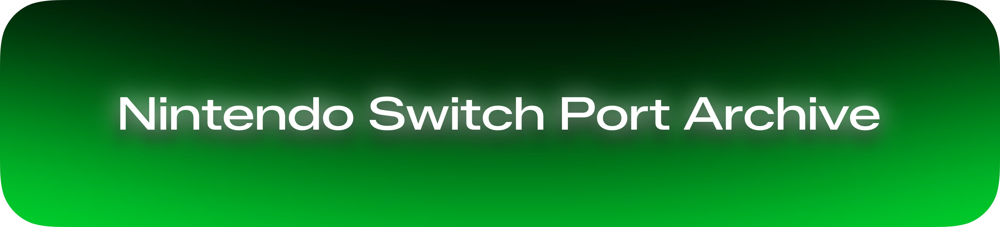

  

**A growing collection of pre-compiled homebrew ports for the Nintendo Switch, organized and archived for ease of access.**

<a href="https://preservia.github.io/ports">The Nintendo Switch Port Archive</a>

### About
This repository serves as an expansive archive for Nintendo Switch homebrew ports. Every port has detailed metadata including the source, authors, and versions. Currently, downloads are hosted on either catbox.moe or Internet Archive, so download speeds may vary. All ports have been tested and are confirmed to work on 20.1.0.

### Currently Available Ports
- Ship of Harkinian
- 2Ship2Harkinian
- Starship
- Spaghetti Kart
- sm64ex_alo
- Perfect Dark
- The Simpsons Hit and Run
- Max Payne NX
- OpenRCT2
- Fallout: CE
- Fallout 2: CE
- OpenLara
- Xash3D FWGS
- Space Cadet Pinbal

  

